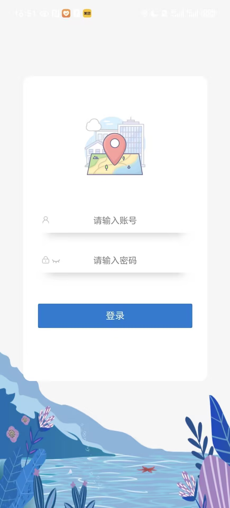
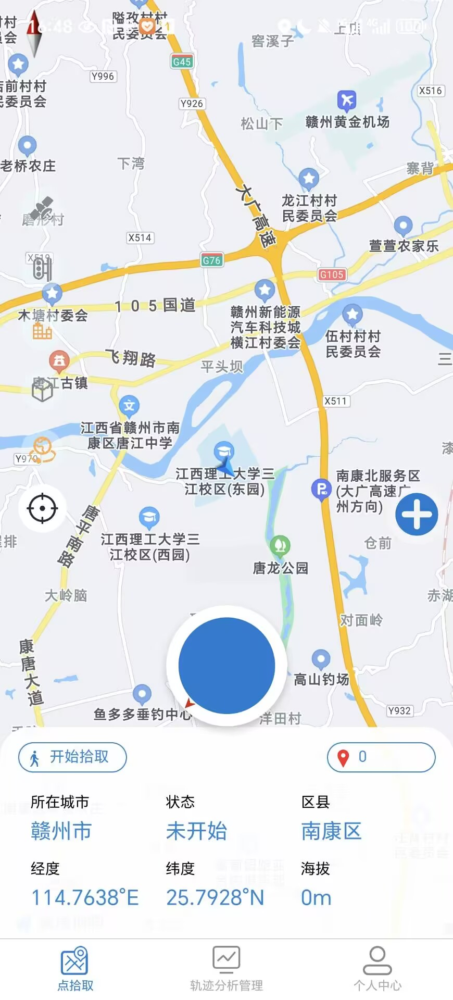
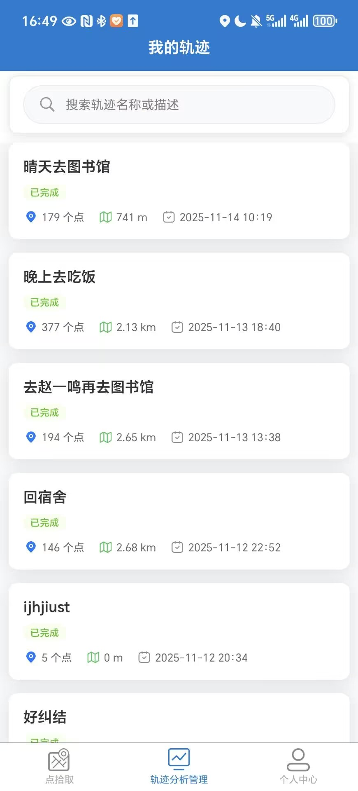
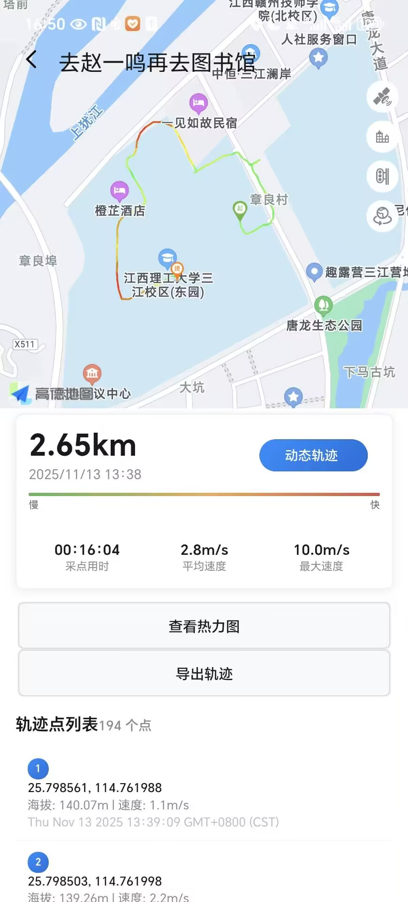
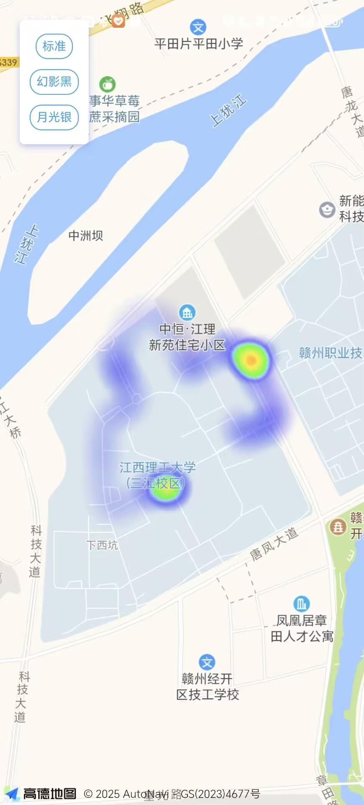
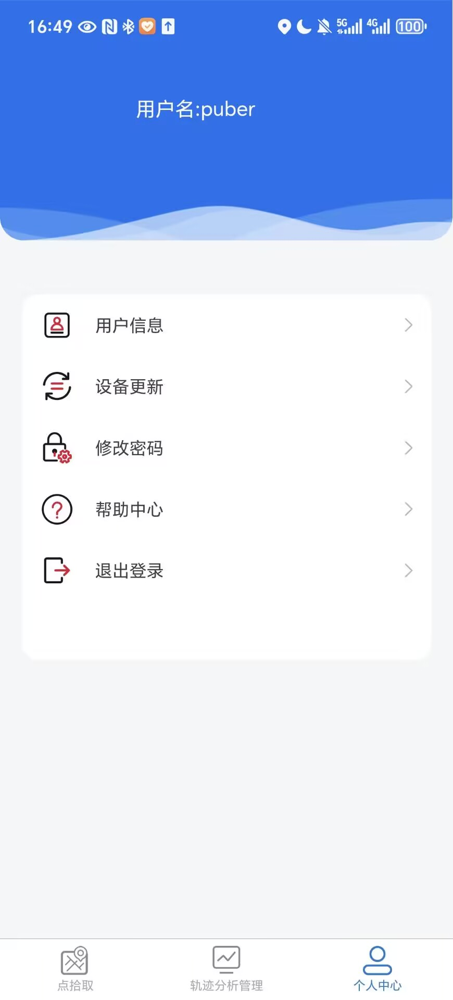

# 个人轨迹管理与分析系统

一个基于uni-app开发的个人轨迹管理与分析移动应用，包含前端移动端和后端服务。

## 快速开始

### 后端启动
```bash
cd backend
# 配置数据库连接信息
vim src/main/resources/application.yml
# 启动服务
mvn spring-boot:run
```

### 前端启动
1. 使用 HBuilderX 打开 `frontend` 目录
2. 配置 `config.js` 中的后端 API 地址
3. 选择运行平台并启动
4. 如需截图展示，可在各功能页面截图并放入 `screenshots` 目录

## 项目结构

```
├── frontend/              # uni-app前端项目
│   ├── components/        # 组件
│   ├── pages/            # 页面
│   ├── static/           # 静态资源
│   ├── utils/            # 工具函数
│   ├── uni_modules/      # uni-app模块
│   ├── common/           # 公共代码
│   ├── nativeplugins/    # 原生插件
│   ├── App.vue           # 应用入口
|   ├── config.js         # 环境变量配置(后端地址)
│   ├── main.js           # 主程序
│   ├── manifest.json     # 应用配置
│   ├── pages.json        # 页面配置
│   ├── package.json      # 依赖配置
│   └── vue.config.js     # Vue配置
├── backend/              # Java后端服务
│   ├── src/main/java/com/track/
│   │   ├── annotation/           # 自定义注解
│   │   │   ├── RequirePermission.java
│   │   │   ├── LogOperation.java
│   │   │   └── ValidateParam.java
│   │   ├── aspect/               # AOP切面
│   │   │   ├── PermissionAspect.java
│   │   │   ├── LogAspect.java
│   │   │   └── GlobalExceptionHandler.java
│   │   ├── config/               # 配置类
│   │   │   ├── MyBatisPlusConfig.java
│   │   │   ├── RedisConfig.java
│   │   │   └── SecurityConfig.java
│   │   ├── controller/           # 控制器
│   │   │   ├── AuthController.java
│   │   │   ├── MobileController.java
│   │   │   ├── TrackController.java
│   │   │   └── TrackPointController.java
│   │   ├── dto/                  # 数据传输对象
│   │   ├── entity/               # 实体类
│   │   ├── mapper/               # MyBatis映射器
│   │   ├── service/              # 业务服务
│   │   ├── util/                 # 工具类
│   │   └── validator/            # 校验工具
│   │       └── ParamValidator.java
│   ├── src/main/resources/
│   │   ├── application.yml       # 应用配置文件
│   │   └── schema.sql            # 数据库初始化脚本
│   ├── Dockerfile                # Docker镜像构建
│   ├── docker-compose.yml        # 容器编排
│   └── pom.xml                   # Maven配置
├── unpackage/            # 构建产物（不上传）
├── screenshots/          # 应用截图目录
├── .gitignore            # Git忽略配置
└── README.md             # 项目说明
```

## 技术栈

### 前端
- uni-app (Vue 2)
- 高德地图API
- ECharts图表
- Axios网络请求

### 后端
- **框架**: Spring Boot 2.7.18
- **安全**: Spring Security + JWT
- **数据库**: PostgreSQL
- **缓存**: Redis
- **ORM**: MyBatis-Plus
- **AOP**: Spring AOP + 自定义注解系统
- **构建工具**: Maven
- **容器化**: Docker + Docker Compose

## 环境配置

### 前端配置（基于uni-app）

**重要：本项目是基于uni-app开发的移动应用，需要使用HBuilderX进行开发和构建。**

1. **安装HBuilderX**
   - 下载并安装 [HBuilderX](https://www.dcloud.io/hbuilderx.html)
   - 建议使用标准版或App开发版

2. **打开项目**
   - 使用HBuilderX打开 `frontend` 目录
   - 项目会自动识别为uni-app项目

3. **安装第三方依赖**
   ```bash
   cd frontend
   npm install
   ```

   **第三方依赖说明：**
   - `@amap/amap-jsapi-loader` - 高德地图JavaScript API加载器
   - `axios` - HTTP请求库
   - `cheerio` - 服务器端HTML解析（用于数据抓取）
   - `cordova` - 混合应用开发框架
   - `echarts` - 数据可视化图表库
   - `htmlparser2` - HTML解析器
   - `http` - Node.js HTTP模块

4. **配置开发环境**
   - 在 `manifest.json` 中配置高德地图API密钥
   - 在`config.js`中配置后端api的url
   - 根据需要配置其他应用设置
   

5. **运行项目**
   - 在HBuilderX中选择运行平台（H5、微信小程序、App等）
   - 点击运行按钮启动开发环境

### 后端配置

#### 环境要求
- Java 8+
- Maven 3.6+
- Docker 20.10+
- Docker Compose 1.29+

#### 使用Docker Compose启动（推荐）

1. **启动所有服务**
   ```bash
   cd backend
   docker-compose up -d
   ```

2. **查看服务状态**
   ```bash
   docker-compose ps
   ```

3. **停止服务**
   ```bash
   docker-compose down
   ```

#### 本地开发环境

1. **启动依赖服务**
   ```bash
   # 只启动数据库和Redis
   cd backend
   docker-compose up -d postgres redis
   ```

2. **配置环境变量**
   ```bash
   # 复制并修改配置文件
   cp src/main/resources/application.yml.example src/main/resources/application.yml
   ```

3. **运行应用**
   ```bash
   # 方式一：使用Maven
   mvn spring-boot:run

   # 方式二：打包后运行
   mvn clean package
   java -jar target/track-backend-1.0.0.jar
   ```

#### 配置说明
- **application.yml**: 应用配置文件，包含数据库、Redis、服务器端口等配置
- **schema.sql**: 数据库初始化脚本，包含表结构和索引
- **Dockerfile**: Docker镜像构建配置
- **docker-compose.yml**: 容器编排配置

## APK打包教程

**重要：APK打包必须使用HBuilderX，uni-app的构建和打包由HBuilderX统一管理。**

### 使用HBuilderX云打包（推荐）

1. **准备工作**
   - 确保已安装 [HBuilderX](https://www.dcloud.io/hbuilderx.html)
   - 使用HBuilderX打开 `frontend` 目录
   - 确保项目能正常运行

2. **配置应用信息**
   - 打开 `manifest.json` 文件
   - 在 "基础配置" 中设置应用名称、版本等
   - 在 "App图标配置" 中上传应用图标
   - 在 "App启动图配置" 中设置启动画面
   - 在 "App模块配置" 中确保已勾选所需模块（地图、定位等）

3. **配置高德地图**
   - 在 `manifest.json` → "App SDK配置" → "地图" → "高德地图"
   - 配置Android和iOS平台的API密钥

4. **生成签名证书**
   - 点击 "发行" → "原生App-云打包"
   - 选择 "Android" 平台
   - 点击 "证书" 生成或选择现有证书
   - 填写证书别名、密码等信息（妥善保管）

5. **执行云打包**
   - 选择打包模式："传统打包" 或 "安心打包"
   - 勾选需要的模块和权限
   - 点击 "打包" 等待云端构建完成
   - 下载生成的APK文件到 `unpackage/release/apk/` 目录

### 方式二：使用命令行

1. **安装uni-app CLI**
   ```bash
   npm install -g @dcloudio/uni-cli
   ```

2. **构建Android项目**
   ```bash
   # 构建Android项目
   npm run build:app-plus
   
   # 或使用HBuilderX CLI
   hbx build --platform android
   ```

3. **使用Android Studio打包**
   - 生成的Android项目位于 `unpackage/dist/build/android`
   - 用Android Studio打开项目
   - 配置签名证书
   - 执行 Build → Generate Signed Bundle / APK

### 方式三：使用GitHub Actions自动构建

创建 `.github/workflows/build-android.yml`：

```yaml
name: Build Android APK

on:
  push:
    tags:
      - 'v*'

jobs:
  build:
    runs-on: ubuntu-latest

    steps:
    - uses: actions/checkout@v3

    - name: Setup Node.js
      uses: actions/setup-node@v3
      with:
        node-version: '16'

    - name: Install dependencies
      run: npm install

    - name: Build APK
      run: |
        # 这里需要配置HBuilderX云打包API
        # 或使用其他构建方式
        echo "构建APK"

    - name: Upload APK
      uses: actions/upload-artifact@v3
      with:
        name: app-release
        path: unpackage/release/apk/*.apk
```

### 打包注意事项

1. **证书安全**
   - 妥善保管签名证书和密码
   - 不要将证书文件上传到Git仓库
   - 建议使用不同的证书用于调试和发布

2. **权限配置**
   - 在 `manifest.json` 中正确配置应用权限
   - 确保位置权限、存储权限等已开启

3. **API密钥配置**
   - 配置高德地图Android平台API密钥
   - 确保密钥与打包证书的SHA1指纹匹配

4. **版本管理**
   - 每次发布更新 `versionName` 和 `versionCode`
   - `versionCode` 必须递增

## 自定义注解系统

本项目实现了基于Spring AOP的自定义注解系统，提供声明式的权限验证、操作日志记录和参数校验功能。

### 权限验证注解 `@RequirePermission`

自动验证用户对资源的访问权限，支持多种资源类型和操作类型。

**使用示例：**
```java
@RequirePermission(resourceType = "track", resourceIdParam = "id")
@GetMapping("/{id}")
public ResponseEntity<Track> getTrack(@PathVariable Long id) {
    // 权限验证已通过AOP处理
    Track track = trackService.getById(id);
    return ResponseEntity.ok(track);
}
```

**参数说明：**
- `resourceType`: 资源类型（如：track, user, point等）
- `resourceIdParam`: 资源ID参数名（方法参数名）
- `operation`: 权限操作类型（如：read, write, delete等）

### 操作日志注解 `@LogOperation`

自动记录方法执行日志，支持SpEL表达式动态获取资源ID。

**使用示例：**
```java
@LogOperation(operation = "查询轨迹", resourceId = "#id", logParams = true)
@GetMapping("/{id}")
public ResponseEntity<Track> getTrack(@PathVariable Long id) {
    // 操作日志已自动记录
    Track track = trackService.getById(id);
    return ResponseEntity.ok(track);
}
```

**参数说明：**
- `operation`: 操作描述
- `resourceId`: 资源ID表达式（支持SpEL，如："#id"）
- `logParams`: 是否记录请求参数
- `logResult`: 是否记录执行结果

### 参数校验注解 `@ValidateParam`

自定义参数校验规则，支持多种校验类型。

**使用示例：**
```java
@ValidateParam(type = "username", message = "用户名格式不正确")
private String username;

@ValidateParam(type = "email", message = "邮箱格式不正确")
private String email;
```

**支持的校验类型：**
- `username`: 用户名校验（字母、数字、下划线、中文，长度3-50位）
- `email`: 邮箱格式校验
- `phone`: 手机号格式校验
- `password`: 密码强度校验

### 注解系统优势

#### 代码简洁性
- **减少70%** 的重复权限验证代码
- **消除** 手动日志记录代码
- **统一** 参数校验逻辑

#### 可维护性
- 权限逻辑集中管理，修改只需改一处
- 日志格式统一，便于分析和监控
- 校验规则可复用，易于扩展

#### 开发效率
- 声明式编程，代码意图更清晰
- 自动处理横切关注点，专注业务逻辑
- 减少错误，提高代码质量

#### 扩展性
- 易于添加新的注解和切面
- 支持多种资源类型和操作类型
- 可与其他Spring组件无缝集成

## API接口详细说明

### 认证接口 (AuthController)

#### 用户登录
- **URL**: `POST /api/auth/login`
- **请求体**:
  ```json
  {
    "username": "用户名",
    "password": "密码"
  }
  ```
- **响应**:
  ```json
  {
    "token": "JWT令牌",
    "id": 用户ID,
    "username": "用户名",
    "email": "邮箱",
    "realName": "真实姓名"
  }
  ```
- **说明**: 用户登录认证，返回 JWT token

#### 用户注册
- **URL**: `POST /api/auth/register`
- **请求体**:
  ```json
  {
    "username": "用户名",
    "password": "密码",
    "email": "邮箱",
    "phone": "手机号",
    "realName": "真实姓名"
  }
  ```
- **响应**:
  ```json
  {
    "message": "User registered successfully!"
  }
  ```
- **说明**: 新用户注册

### 轨迹管理接口 (TrackController)

#### 创建轨迹
- **URL**: `POST /api/tracks`
- **认证**: 需要 JWT token
- **请求体**:
  ```json
  {
    "trackName": "轨迹名称",
    "description": "轨迹描述",
    "startTime": "开始时间",
    "endTime": "结束时间"
  }
  ```
- **说明**: 创建新的轨迹记录

#### 获取用户轨迹列表
- **URL**: `GET /api/tracks`
- **认证**: 需要 JWT token
- **参数**:
  - `page` (可选): 页码，默认1
  - `pageSize` (可选): 每页大小，默认10
- **说明**: 获取当前用户的轨迹列表，支持分页

#### 获取轨迹详情
- **URL**: `GET /api/tracks/{id}`
- **认证**: 需要 JWT token
- **说明**: 获取指定轨迹的详细信息

#### 更新轨迹
- **URL**: `PUT /api/tracks/{id}`
- **认证**: 需要 JWT token
- **请求体**: 轨迹对象
- **说明**: 更新轨迹信息

#### 删除轨迹
- **URL**: `DELETE /api/tracks/{id}`
- **认证**: 需要 JWT token
- **说明**: 删除轨迹及其关联的轨迹点数据

#### 获取轨迹详情（包含轨迹点）
- **URL**: `GET /api/tracks/{id}/detail`
- **认证**: 需要 JWT token
- **响应**: 包含轨迹信息和轨迹点列表的完整详情

#### 搜索轨迹
- **URL**: `GET /api/tracks/search`
- **认证**: 需要 JWT token
- **参数**:
  - `page` (可选): 页码，默认1
  - `pageSize` (可选): 每页大小，默认10
  - `keyword` (可选): 搜索关键字（轨迹名称和描述）
  - `startDate` (可选): 开始日期，格式 `yyyy-MM-dd`
  - `endDate` (可选): 结束日期，格式 `yyyy-MM-dd`
- **说明**: 基于 `create_time` 字段进行日期范围搜索

#### 导出轨迹
- **URL**: `GET /api/tracks/{id}/export/{format}`
- **认证**: 需要 JWT token
- **参数**:
  - `format`: 导出格式，支持 `gpx`, `kml`, `csv`, `geojson`
- **说明**: 导出轨迹数据到不同格式

### 轨迹点管理接口 (TrackPointController)

#### 添加轨迹点
- **URL**: `POST /api/tracks/{trackId}/points`
- **认证**: 需要 JWT token
- **请求体**:
  ```json
  {
    "longitude": 经度,
    "latitude": 纬度,
    "altitude": 海拔,
    "speed": 速度,
    "accuracy": 精度,
    "satelliteCount": 卫星数量,
    "address": "地址信息"
  }
  ```
- **说明**: 为指定轨迹添加轨迹点

#### 获取轨迹点列表
- **URL**: `GET /api/tracks/{trackId}/points`
- **认证**: 需要 JWT token
- **说明**: 获取指定轨迹的所有轨迹点

### 移动端兼容接口 (MobileController)

#### 添加轨迹点（兼容接口）
- **URL**: `GET /api/addcoordpoint`
- **认证**: 需要 JWT token
- **参数**:
  - `liid`: 轨迹ID
  - `x`: 经度
  - `y`: 纬度
  - `z`: 海拔
  - `speed` (可选): 速度
  - `address` (可选): 地址信息
- **说明**: 兼容前端旧版接口的轨迹点添加

#### 更新轨迹状态（兼容接口）
- **URL**: `GET /api/updateroute`
- **认证**: 需要 JWT token
- **参数**:
  - `liid`: 轨迹ID
- **说明**: 将轨迹状态更新为已完成

#### 获取用户信息（兼容接口）
- **URL**: `GET /api/getstaffinfo`
- **认证**: 需要 JWT token
- **参数**:
  - `username`: 用户名
- **响应**:
  ```json
  {
    "PhoneType": "设备型号",
    "Account": "用户名",
    "Name": "真实姓名",
    "Phone": "手机号"
  }
  ```

#### 更新设备信息（兼容接口）
- **URL**: `GET /api/updatestaffinfo`
- **认证**: 需要 JWT token
- **参数**:
  - `username`: 用户名
  - `phonetype`: 设备型号
- **说明**: 更新用户的设备信息

#### 通用API接口
- **URL**: `GET /api`
- **认证**: 需要 JWT token
- **参数**:
  - `action`: 操作类型，支持 `login`, `addcoordpoint`, `updateroute`, `getstaffinfo`, `updatestaffinfo`, `updatepassword`
- **说明**: 通用接口，根据action参数执行不同操作

### 日期查询特性
- 支持 `yyyy-MM-dd` 格式的日期参数自动转换
- 日期范围查询：`startDate` 到 `endDate` 之间的所有记录
- 时间范围：`startDate 00:00:00` 到 `endDate 23:59:59`

## API密钥配置

项目使用高德地图服务，需要配置API密钥：

1. 申请高德地图开发者账号
2. 获取Web服务API Key和Android/iOS Key
3. 在manifest.json中配置对应的密钥

## 功能特性

- 个人轨迹记录
- 轨迹数据展示
- 地图轨迹可视化
- 轨迹点热力图

## 应用截图展示

### 登录页面
<div align="center">
  
</div>
- 用户登录界面
- 支持用户名密码登录

### 地图采集页面
<div align="center">
  
</div>
- 实时位置显示
- 轨迹点采集功能
- 地图可视化

### 轨迹管理页面
<div align="center">
  
</div>
- 个人轨迹列表
- 轨迹搜索和筛选
- 日期范围查询

### 轨迹详情页面
<div align="center">
  
</div>
- 轨迹详细信息
- 轨迹点数据展示
- 统计信息

### 热力图展示
<div align="center">
  
</div>
- 轨迹点密度热力图
- 活动热点区域可视化

### 个人中心
<div align="center">
  
</div>
- 用户信息管理
- 设备信息配置

## 许可证

MIT License